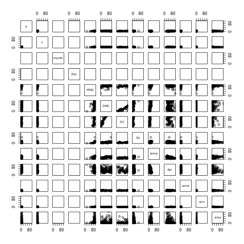
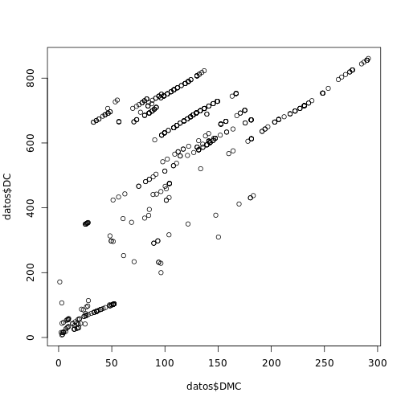
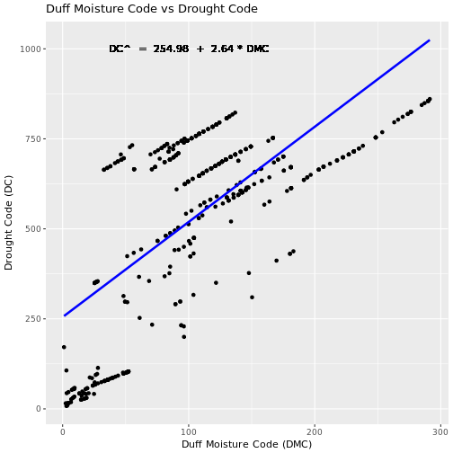

##Carga de Paquetes

```r
library("dplyr")
library("ggplot2")
library("stringr")
library("lubridate")
library("tidyr")
```

##Especificacion del Dataset
>
1. X - coordenada espacial del eje x dentro del mapa del parque de Montesinho: 1 to 9 
2. Y - coordenada espacial del eje y dentro del mapa del parque de Montesinho: 2 to 9 
3. month - mes del anio: 'jan' to 'dec' 
4. day - dia de la semana: 'mon' to 'sun' 
5. FFMC - indice FFMC del sistema FWI: 18.7 to 96.20 
6. DMC - indice DMC del sistema FWI: 1.1 to 291.3 
7. DC - indice DC del sistema FWI: 7.9 to 860.6 
8. ISI - indice ISI del sistema FWI: 0.0 to 56.10 
9. temp - temperatura en grados Celsius: 2.2 to 33.30 
10. RH - humedad relativa en %: 15.0 a 100
11. wind - velocidad del viento en km / h: 0.40 a 9.40 
12. rain - lluvia exterior en mm / m2: de 0.0 a 6.4 
13. area - el area quemada del bosque (en ha): 0.00 a 1090.84

###Carga de Datos

```r
datos<- read.csv("/home/rstudio/ProyectoFinal/dataset/forestfires.csv",stringsAsFactors = FALSE,check.names = FALSE)
datos
```

```
##     X Y month day FFMC   DMC    DC  ISI temp  RH wind rain    area
## 1   7 5   mar fri 86.2  26.2  94.3  5.1  8.2  51  6.7  0.0    0.00
## 2   7 4   oct tue 90.6  35.4 669.1  6.7 18.0  33  0.9  0.0    0.00
## 3   7 4   oct sat 90.6  43.7 686.9  6.7 14.6  33  1.3  0.0    0.00
## 4   8 6   mar fri 91.7  33.3  77.5  9.0  8.3  97  4.0  0.2    0.00
## 5   8 6   mar sun 89.3  51.3 102.2  9.6 11.4  99  1.8  0.0    0.00
## 6   8 6   aug sun 92.3  85.3 488.0 14.7 22.2  29  5.4  0.0    0.00
## 7   8 6   aug mon 92.3  88.9 495.6  8.5 24.1  27  3.1  0.0    0.00
## 8   8 6   aug mon 91.5 145.4 608.2 10.7  8.0  86  2.2  0.0    0.00
## 9   8 6   sep tue 91.0 129.5 692.6  7.0 13.1  63  5.4  0.0    0.00
## 10  7 5   sep sat 92.5  88.0 698.6  7.1 22.8  40  4.0  0.0    0.00
## 11  7 5   sep sat 92.5  88.0 698.6  7.1 17.8  51  7.2  0.0    0.00
## 12  7 5   sep sat 92.8  73.2 713.0 22.6 19.3  38  4.0  0.0    0.00
## 13  6 5   aug fri 63.5  70.8 665.3  0.8 17.0  72  6.7  0.0    0.00
## 14  6 5   sep mon 90.9 126.5 686.5  7.0 21.3  42  2.2  0.0    0.00
## 15  6 5   sep wed 92.9 133.3 699.6  9.2 26.4  21  4.5  0.0    0.00
## 16  6 5   sep fri 93.3 141.2 713.9 13.9 22.9  44  5.4  0.0    0.00
## 17  5 5   mar sat 91.7  35.8  80.8  7.8 15.1  27  5.4  0.0    0.00
## 18  8 5   oct mon 84.9  32.8 664.2  3.0 16.7  47  4.9  0.0    0.00
## 19  6 4   mar wed 89.2  27.9  70.8  6.3 15.9  35  4.0  0.0    0.00
## 20  6 4   apr sat 86.3  27.4  97.1  5.1  9.3  44  4.5  0.0    0.00
## 21  6 4   sep tue 91.0 129.5 692.6  7.0 18.3  40  2.7  0.0    0.00
## 22  5 4   sep mon 91.8  78.5 724.3  9.2 19.1  38  2.7  0.0    0.00
## 23  7 4   jun sun 94.3  96.3 200.0 56.1 21.0  44  4.5  0.0    0.00
## 24  7 4   aug sat 90.2 110.9 537.4  6.2 19.5  43  5.8  0.0    0.00
## 25  7 4   aug sat 93.5 139.4 594.2 20.3 23.7  32  5.8  0.0    0.00
## 26  7 4   aug sun 91.4 142.4 601.4 10.6 16.3  60  5.4  0.0    0.00
## 27  7 4   sep fri 92.4 117.9 668.0 12.2 19.0  34  5.8  0.0    0.00
## 28  7 4   sep mon 90.9 126.5 686.5  7.0 19.4  48  1.3  0.0    0.00
## 29  6 3   sep sat 93.4 145.4 721.4  8.1 30.2  24  2.7  0.0    0.00
## 30  6 3   sep sun 93.5 149.3 728.6  8.1 22.8  39  3.6  0.0    0.00
## 31  6 3   sep fri 94.3  85.1 692.3 15.9 25.4  24  3.6  0.0    0.00
## 32  6 3   sep mon 88.6  91.8 709.9  7.1 11.2  78  7.6  0.0    0.00
## 33  6 3   sep fri 88.6  69.7 706.8  5.8 20.6  37  1.8  0.0    0.00
## 34  6 3   sep sun 91.7  75.6 718.3  7.8 17.7  39  3.6  0.0    0.00
## 35  6 3   sep mon 91.8  78.5 724.3  9.2 21.2  32  2.7  0.0    0.00
## 36  6 3   sep tue 90.3  80.7 730.2  6.3 18.2  62  4.5  0.0    0.00
## 37  6 3   oct tue 90.6  35.4 669.1  6.7 21.7  24  4.5  0.0    0.00
## 38  7 4   oct fri 90.0  41.5 682.6  8.7 11.3  60  5.4  0.0    0.00
## 39  7 3   oct sat 90.6  43.7 686.9  6.7 17.8  27  4.0  0.0    0.00
## 40  4 4   mar tue 88.1  25.7  67.6  3.8 14.1  43  2.7  0.0    0.00
## 41  4 4   jul tue 79.5  60.6 366.7  1.5 23.3  37  3.1  0.0    0.00
## 42  4 4   aug sat 90.2  96.9 624.2  8.9 18.4  42  6.7  0.0    0.00
## 43  4 4   aug tue 94.8 108.3 647.1 17.0 16.6  54  5.4  0.0    0.00
## 44  4 4   sep sat 92.5  88.0 698.6  7.1 19.6  48  2.7  0.0    0.00
## 45  4 4   sep wed 90.1  82.9 735.7  6.2 12.9  74  4.9  0.0    0.00
## 46  5 6   sep wed 94.3  85.1 692.3 15.9 25.9  24  4.0  0.0    0.00
## 47  5 6   sep mon 90.9 126.5 686.5  7.0 14.7  70  3.6  0.0    0.00
## 48  6 6   jul mon 94.2  62.3 442.9 11.0 23.0  36  3.1  0.0    0.00
## 49  4 4   mar mon 87.2  23.9  64.7  4.1 11.8  35  1.8  0.0    0.00
## 50  4 4   mar mon 87.6  52.2 103.8  5.0 11.0  46  5.8  0.0    0.00
## 51  4 4   sep thu 92.9 137.0 706.4  9.2 20.8  17  1.3  0.0    0.00
## 52  4 3   aug sun 90.2  99.6 631.2  6.3 21.5  34  2.2  0.0    0.00
## 53  4 3   aug wed 92.1 111.2 654.1  9.6 20.4  42  4.9  0.0    0.00
## 54  4 3   aug wed 92.1 111.2 654.1  9.6 20.4  42  4.9  0.0    0.00
## 55  4 3   aug thu 91.7 114.3 661.3  6.3 17.6  45  3.6  0.0    0.00
## 56  4 3   sep thu 92.9 137.0 706.4  9.2 27.7  24  2.2  0.0    0.00
## 57  4 3   sep tue 90.3  80.7 730.2  6.3 17.8  63  4.9  0.0    0.00
## 58  4 3   oct sun 92.6  46.5 691.8  8.8 13.8  50  2.7  0.0    0.00
## 59  2 2   feb mon 84.0   9.3  34.0  2.1 13.9  40  5.4  0.0    0.00
## 60  2 2   feb fri 86.6  13.2  43.0  5.3 12.3  51  0.9  0.0    0.00
## 61  2 2   mar sun 89.3  51.3 102.2  9.6 11.5  39  5.8  0.0    0.00
## 62  2 2   mar sun 89.3  51.3 102.2  9.6  5.5  59  6.3  0.0    0.00
## 63  2 2   aug thu 93.0  75.3 466.6  7.7 18.8  35  4.9  0.0    0.00
## 64  2 2   aug sun 90.2  99.6 631.2  6.3 20.8  33  2.7  0.0    0.00
## 65  2 2   aug mon 91.1 103.2 638.8  5.8 23.1  31  3.1  0.0    0.00
## 66  2 2   aug thu 91.7 114.3 661.3  6.3 18.6  44  4.5  0.0    0.00
## 67  2 2   sep fri 92.4 117.9 668.0 12.2 23.0  37  4.5  0.0    0.00
## 68  2 2   sep fri 92.4 117.9 668.0 12.2 19.6  33  5.4  0.0    0.00
## 69  2 2   sep fri 92.4 117.9 668.0 12.2 19.6  33  6.3  0.0    0.00
## 70  4 5   mar fri 91.7  33.3  77.5  9.0 17.2  26  4.5  0.0    0.00
## 71  4 5   mar fri 91.2  48.3  97.8 12.5 15.8  27  7.6  0.0    0.00
## 72  4 5   sep fri 94.3  85.1 692.3 15.9 17.7  37  3.6  0.0    0.00
## 73  5 4   mar fri 91.7  33.3  77.5  9.0 15.6  25  6.3  0.0    0.00
## 74  5 4   aug tue 88.8 147.3 614.5  9.0 17.3  43  4.5  0.0    0.00
## 75  5 4   sep fri 93.3 141.2 713.9 13.9 27.6  30  1.3  0.0    0.00
## 76  9 9   feb thu 84.2   6.8  26.6  7.7  6.7  79  3.1  0.0    0.00
##  [ reached getOption("max.print") -- omitted 441 rows ]
```
## Exploracion de datos

```r
plot(datos,xlim=c(0,100),ylim=c(0,100))
```

```
## Warning in data.matrix(x): NAs introduced by coercion

## Warning in data.matrix(x): NAs introduced by coercion
```



```r
plot(datos$DMC,datos$DC)
```



#Regresiones lineales

```r
x<-datos$DMC
y<-datos$DC
dt=data.frame(x,y)
vx=c(18,30,40,60,80)
regresion <- function(dt,vx){
  lista <- NULL
  x=dt$x
  y=dt$y
  sumX=sum(x)
  sumY=sum(y)
  prodXY=sum(x*y)
  promX=mean(x)
  dt$x2=x^2
  dt$y2=y^2
  x2=sum(x^2)
  y2=sum(y^2)
  
  promY<-mean(y)
  #calculo de la covarianza
  cov = (prodXY/length(x))-(promX*promY)
  #calculo de las desviacion estandar x, y
  dx=sqrt((x2/length(x))-promX^2)
  dy=sqrt((y2/length(y))-promY^2)
  #coeficiente de correlacion de Pearson
  r=cov/(dx*dy)
  #generando recta regresional
  vy=promY+(cov/dx^2)*(vx-promX)
  lista[[1]]<-dt #dt entrenamiento
  lista[[2]]<-vx #datos de validacion
  lista[[3]]<-vy #datos predecidos
  lista[[4]]<-r  #coeficiente de correlacion de Pearson
  return (lista)
}

modelo <- lm(DC ~ DMC, data = datos)
DCs <- predict(modelo,datos) #Valores Predichos
b0 <- round(modelo$coefficients[1],2)
b1 <- round(modelo$coefficients[2],2)
qplot(x = DMC, y = DC,data = datos, 
      main = "Duff Moisture Code vs Drought Code", xlab = "Duff Moisture Code (DMC)",
      ylab = "Drought Code (DC)", geom = c("point")) + geom_line(aes(y=DCs), lwd = 1.2, color = 4) +
  geom_text(x = 100, y = 1000, aes(label = paste("DC^", " = ", b0, " + ", b1, "*","DMC")))
```



