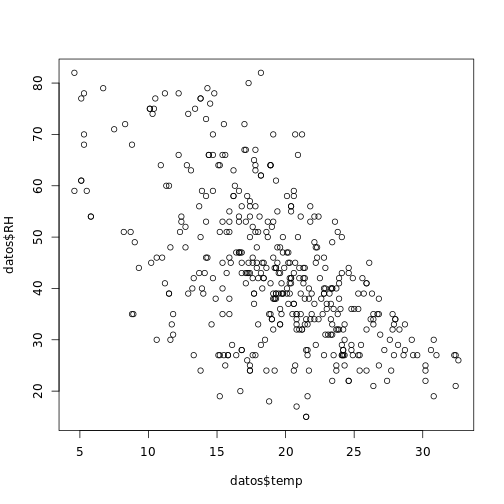

##Carga de Paquetes

```r
library("dplyr")
library("ggplot2")
library("stringr")
library("lubridate")
library("tidyr")
```

##Especificacion del Dataset
>
1. X - coordenada espacial del eje x dentro del mapa del parque de Montesinho: 1 to 9 
2. Y - coordenada espacial del eje y dentro del mapa del parque de Montesinho: 2 to 9 
3. month - mes del anio: 'jan' to 'dec' 
4. day - dia de la semana: 'mon' to 'sun' 
5. FFMC - indice FFMC del sistema FWI: 18.7 to 96.20 
6. DMC - indice DMC del sistema FWI: 1.1 to 291.3 
7. DC - indice DC del sistema FWI: 7.9 to 860.6 
8. ISI - indice ISI del sistema FWI: 0.0 to 56.10 
9. temp - temperatura en grados Celsius: 2.2 to 33.30 
10. RH - humedad relativa en %: 15.0 a 100
11. wind - velocidad del viento en km / h: 0.40 a 9.40 
12. rain - lluvia exterior en mm / m2: de 0.0 a 6.4 
13. area - el area quemada del bosque (en ha): 0.00 a 1090.84

###Carga de Datos

```r
datos<- read.csv("/home/rstudio/ProyectoFinal/dataset/datosLimpios.csv",stringsAsFactors = FALSE,check.names = FALSE)
datos
```

```
##     X Y month day FFMC   DMC    DC  ISI temp RH wind rain  area
## 1   7 5   mar fri 86.2  26.2  94.3  5.1  8.2 51  6.7    0  0.00
## 2   7 4   oct tue 90.6  35.4 669.1  6.7 18.0 33  0.9    0  0.00
## 3   7 4   oct sat 90.6  43.7 686.9  6.7 14.6 33  1.3    0  0.00
## 4   8 6   aug sun 92.3  85.3 488.0 14.7 22.2 29  5.4    0  0.00
## 5   8 6   aug mon 92.3  88.9 495.6  8.5 24.1 27  3.1    0  0.00
## 6   8 6   sep tue 91.0 129.5 692.6  7.0 13.1 63  5.4    0  0.00
## 7   7 5   sep sat 92.5  88.0 698.6  7.1 22.8 40  4.0    0  0.00
## 8   7 5   sep sat 92.5  88.0 698.6  7.1 17.8 51  7.2    0  0.00
## 9   7 5   sep sat 92.8  73.2 713.0 22.6 19.3 38  4.0    0  0.00
## 10  6 5   aug fri 63.5  70.8 665.3  0.8 17.0 72  6.7    0  0.00
## 11  6 5   sep mon 90.9 126.5 686.5  7.0 21.3 42  2.2    0  0.00
## 12  6 5   sep wed 92.9 133.3 699.6  9.2 26.4 21  4.5    0  0.00
## 13  6 5   sep fri 93.3 141.2 713.9 13.9 22.9 44  5.4    0  0.00
## 14  5 5   mar sat 91.7  35.8  80.8  7.8 15.1 27  5.4    0  0.00
## 15  8 5   oct mon 84.9  32.8 664.2  3.0 16.7 47  4.9    0  0.00
## 16  6 4   mar wed 89.2  27.9  70.8  6.3 15.9 35  4.0    0  0.00
## 17  6 4   apr sat 86.3  27.4  97.1  5.1  9.3 44  4.5    0  0.00
## 18  6 4   sep tue 91.0 129.5 692.6  7.0 18.3 40  2.7    0  0.00
## 19  5 4   sep mon 91.8  78.5 724.3  9.2 19.1 38  2.7    0  0.00
## 20  7 4   jun sun 94.3  96.3 200.0 56.1 21.0 44  4.5    0  0.00
## 21  7 4   aug sat 90.2 110.9 537.4  6.2 19.5 43  5.8    0  0.00
## 22  7 4   aug sat 93.5 139.4 594.2 20.3 23.7 32  5.8    0  0.00
## 23  7 4   aug sun 91.4 142.4 601.4 10.6 16.3 60  5.4    0  0.00
## 24  7 4   sep fri 92.4 117.9 668.0 12.2 19.0 34  5.8    0  0.00
## 25  7 4   sep mon 90.9 126.5 686.5  7.0 19.4 48  1.3    0  0.00
## 26  6 3   sep sat 93.4 145.4 721.4  8.1 30.2 24  2.7    0  0.00
## 27  6 3   sep sun 93.5 149.3 728.6  8.1 22.8 39  3.6    0  0.00
## 28  6 3   sep fri 94.3  85.1 692.3 15.9 25.4 24  3.6    0  0.00
## 29  6 3   sep mon 88.6  91.8 709.9  7.1 11.2 78  7.6    0  0.00
## 30  6 3   sep fri 88.6  69.7 706.8  5.8 20.6 37  1.8    0  0.00
## 31  6 3   sep sun 91.7  75.6 718.3  7.8 17.7 39  3.6    0  0.00
## 32  6 3   sep mon 91.8  78.5 724.3  9.2 21.2 32  2.7    0  0.00
## 33  6 3   sep tue 90.3  80.7 730.2  6.3 18.2 62  4.5    0  0.00
## 34  6 3   oct tue 90.6  35.4 669.1  6.7 21.7 24  4.5    0  0.00
## 35  7 4   oct fri 90.0  41.5 682.6  8.7 11.3 60  5.4    0  0.00
## 36  7 3   oct sat 90.6  43.7 686.9  6.7 17.8 27  4.0    0  0.00
## 37  4 4   mar tue 88.1  25.7  67.6  3.8 14.1 43  2.7    0  0.00
## 38  4 4   jul tue 79.5  60.6 366.7  1.5 23.3 37  3.1    0  0.00
## 39  4 4   aug sat 90.2  96.9 624.2  8.9 18.4 42  6.7    0  0.00
## 40  4 4   aug tue 94.8 108.3 647.1 17.0 16.6 54  5.4    0  0.00
## 41  4 4   sep sat 92.5  88.0 698.6  7.1 19.6 48  2.7    0  0.00
## 42  4 4   sep wed 90.1  82.9 735.7  6.2 12.9 74  4.9    0  0.00
## 43  5 6   sep wed 94.3  85.1 692.3 15.9 25.9 24  4.0    0  0.00
## 44  5 6   sep mon 90.9 126.5 686.5  7.0 14.7 70  3.6    0  0.00
## 45  6 6   jul mon 94.2  62.3 442.9 11.0 23.0 36  3.1    0  0.00
## 46  4 4   mar mon 87.2  23.9  64.7  4.1 11.8 35  1.8    0  0.00
## 47  4 4   mar mon 87.6  52.2 103.8  5.0 11.0 46  5.8    0  0.00
## 48  4 4   sep thu 92.9 137.0 706.4  9.2 20.8 17  1.3    0  0.00
## 49  4 3   aug sun 90.2  99.6 631.2  6.3 21.5 34  2.2    0  0.00
## 50  4 3   aug wed 92.1 111.2 654.1  9.6 20.4 42  4.9    0  0.00
## 51  4 3   aug wed 92.1 111.2 654.1  9.6 20.4 42  4.9    0  0.00
## 52  4 3   aug thu 91.7 114.3 661.3  6.3 17.6 45  3.6    0  0.00
## 53  4 3   sep thu 92.9 137.0 706.4  9.2 27.7 24  2.2    0  0.00
## 54  4 3   sep tue 90.3  80.7 730.2  6.3 17.8 63  4.9    0  0.00
## 55  4 3   oct sun 92.6  46.5 691.8  8.8 13.8 50  2.7    0  0.00
## 56  2 2   feb mon 84.0   9.3  34.0  2.1 13.9 40  5.4    0  0.00
## 57  2 2   feb fri 86.6  13.2  43.0  5.3 12.3 51  0.9    0  0.00
## 58  2 2   mar sun 89.3  51.3 102.2  9.6 11.5 39  5.8    0  0.00
## 59  2 2   mar sun 89.3  51.3 102.2  9.6  5.5 59  6.3    0  0.00
## 60  2 2   aug thu 93.0  75.3 466.6  7.7 18.8 35  4.9    0  0.00
## 61  2 2   aug sun 90.2  99.6 631.2  6.3 20.8 33  2.7    0  0.00
## 62  2 2   aug mon 91.1 103.2 638.8  5.8 23.1 31  3.1    0  0.00
## 63  2 2   aug thu 91.7 114.3 661.3  6.3 18.6 44  4.5    0  0.00
## 64  2 2   sep fri 92.4 117.9 668.0 12.2 23.0 37  4.5    0  0.00
## 65  2 2   sep fri 92.4 117.9 668.0 12.2 19.6 33  5.4    0  0.00
## 66  2 2   sep fri 92.4 117.9 668.0 12.2 19.6 33  6.3    0  0.00
## 67  4 5   mar fri 91.7  33.3  77.5  9.0 17.2 26  4.5    0  0.00
## 68  4 5   mar fri 91.2  48.3  97.8 12.5 15.8 27  7.6    0  0.00
## 69  4 5   sep fri 94.3  85.1 692.3 15.9 17.7 37  3.6    0  0.00
## 70  5 4   mar fri 91.7  33.3  77.5  9.0 15.6 25  6.3    0  0.00
## 71  5 4   aug tue 88.8 147.3 614.5  9.0 17.3 43  4.5    0  0.00
## 72  5 4   sep fri 93.3 141.2 713.9 13.9 27.6 30  1.3    0  0.00
## 73  9 9   feb thu 84.2   6.8  26.6  7.7  6.7 79  3.1    0  0.00
## 74  9 9   feb fri 86.6  13.2  43.0  5.3 15.7 43  3.1    0  0.00
## 75  1 3   mar mon 87.6  52.2 103.8  5.0  8.3 72  3.1    0  0.00
## 76  1 2   aug fri 90.1 108.0 529.8 12.5 14.7 66  2.7    0  0.00
##  [ reached getOption("max.print") -- omitted 350 rows ]
```
## 1. Promedio de area afectada por incendios

```r
promAreaAfectada<-function(){
  x <- datos %>% summarise(promedio=mean(area)) 
    return(x)
}
promAreaAfectada()
```

```
##   promedio
## 1 2.302793
```
## 2. Area total del bosque que ha sido afectado por los incendios

```r
promTotalAreaAfectada<-function(){
  x <- datos %>% summarise(areaAfectada=sum(area)) 
    return(x)
}
promTotalAreaAfectada()
```

```
##   areaAfectada
## 1       980.99
```
## 3. Numero de incendios por mes

```r
numeroIncendiosxMes<-function(mesP){
  x <- datos %>% filter(str_detect(month,mesP)) %>% group_by(month) %>% summarise(cantidad=n()) 
    return(x)
}
numeroIncendiosxMes("")
```

```
## # A tibble: 11 x 2
##    month cantidad
##    <chr>    <int>
##  1 apr          8
##  2 aug        155
##  3 dec          2
##  4 feb         16
##  5 jan          1
##  6 jul         28
##  7 jun         14
##  8 mar         45
##  9 nov          1
## 10 oct         13
## 11 sep        143
```

## 4. Promedio de temperatura de los incendios por mes

```r
temperaturaxMes<-function(mesP){
  x <- datos %>% filter(str_detect(month,mesP)) %>% group_by(month) %>% summarise(temperatura = mean(temp))
    return(x)
}
temperaturaxMes("")
```

```
## # A tibble: 11 x 2
##    month temperatura
##    <chr>       <dbl>
##  1 apr          11.8
##  2 aug          21.8
##  3 dec           5.1
##  4 feb          10.2
##  5 jan           5.3
##  6 jul          22.6
##  7 jun          20.8
##  8 mar          13.0
##  9 nov          11.8
## 10 oct          17.1
## 11 sep          19.6
```
## 5. Las 5 primeras coordenadas que han presentado mas incendios

```r
Top5Coordenadas<-function(){
  x <- datos %>% group_by(X,Y) %>% summarise(cantidad = n()) %>% arrange(desc(cantidad)) %>% head(5)
    return(x)
}
Top5Coordenadas()
```

```
## # A tibble: 5 x 3
## # Groups:   X [5]
##       X     Y cantidad
##   <int> <int>    <int>
## 1     8     6       41
## 2     7     4       39
## 3     3     4       38
## 4     6     5       38
## 5     2     4       26
```
## 6. Los 10 incendios mas grandes (ha)

```r
Top10Incendios<-function(){
  x <- datos %>% select(c(X,Y,month,RH,area))  %>% arrange(desc(area)) %>% head(10)
    return(x)
}
Top10Incendios()
```

```
##    X Y month RH  area
## 1  5 4   aug 34 16.40
## 2  8 6   aug 63 16.33
## 3  2 4   aug 50 16.00
## 4  7 4   sep 28 15.64
## 5  2 2   aug 31 15.45
## 6  2 4   aug 66 15.34
## 7  3 4   aug 27 14.68
## 8  4 5   sep 34 14.57
## 9  6 3   sep 28 14.29
## 10 5 6   mar 64 13.99
```
## 7. Mes en el que se presento mayor cantidad de incendios

```r
mesMayorIncendio<-function(){
  x <- datos %>% group_by(month) %>% summarise(cantidad=n()) %>% arrange(desc(cantidad)) %>% head(1)
    return(x)
}
mesMayorIncendio()
```

```
## # A tibble: 1 x 2
##   month cantidad
##   <chr>    <int>
## 1 aug        155
```
## 8. Meses en los que se encuentran el top 10 de areas afectadas

```r
MesesTop10Incendios<-function(){
    x <- Top10Incendios() %>% group_by(month) %>% summarise(cantidad=n()) %>% arrange(desc(cantidad))
    return(x)
}
MesesTop10Incendios()
```

```
## # A tibble: 3 x 2
##   month cantidad
##   <chr>    <int>
## 1 aug          6
## 2 sep          3
## 3 mar          1
```
## 9. Zonas cuya humedad relativa sea mayor a la media donde el area afectada este en el Top10

```r
ZonasHumedasTop10<-function(){
    x <- Top10Incendios() %>% select(c(X,Y,RH)) %>% filter(RH>mean(RH))
    return(x)
}
ZonasHumedasTop10()
```

```
##   X Y RH
## 1 8 6 63
## 2 2 4 50
## 3 2 4 66
## 4 5 6 64
```
## 10. 2 temperaturas mas altas por mes

```r
top2TemperaturaxMes<-function(){
  x <- datos %>% group_by(month,temp) %>% summarise(cantidad=n()) %>% top_n(2, temp) %>% arrange(desc(cantidad))
  return(x)
}
top2TemperaturaxMes()
```

```
## # A tibble: 19 x 3
## # Groups:   month [11]
##    month  temp cantidad
##    <chr> <dbl>    <int>
##  1 aug    32.4        2
##  2 dec     5.1        2
##  3 jul    30.2        2
##  4 jun    28          2
##  5 apr    16.7        1
##  6 apr    17.6        1
##  7 aug    32.6        1
##  8 feb    15.4        1
##  9 feb    15.7        1
## 10 jan     5.3        1
## 11 jul    29.3        1
## 12 jun    26.4        1
## 13 mar    18.2        1
## 14 mar    18.8        1
## 15 nov    11.8        1
## 16 oct    20.6        1
## 17 oct    21.7        1
## 18 sep    29.6        1
## 19 sep    30.2        1
```
## Exploracion de datos

```r
plot(datos$DMC,datos$DC)
```


```r
plot(datos$temp,datos$RH)
```


